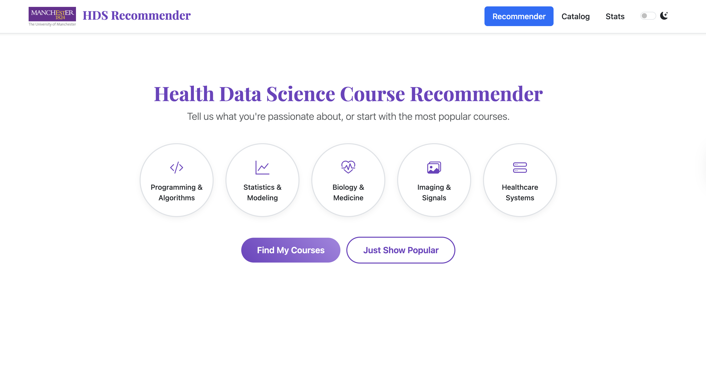
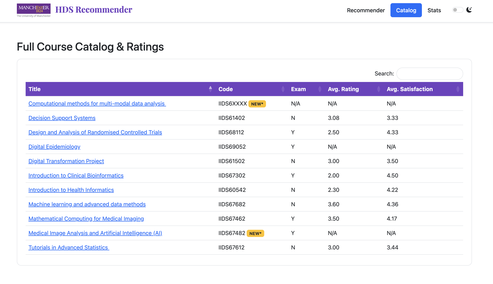
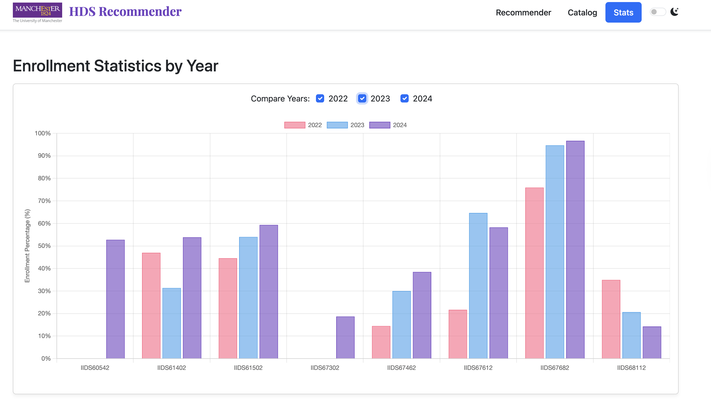

# Health Data Science Course Recommender System

[](https://www.python.org/)
[](https://flask.palletsprojects.com/)
[](https://scikit-learn.org/stable/)
[](https://xgboost.readthedocs.io/en/stable/)

An intelligent course recommender system designed to assist students in the MSc Health Data Science program in discovering the most relevant optional courses based on their academic history and interests. This project integrates multiple recommendation algorithms and serves them through an interactive web interface.

## Overview & Features

The system provides an intuitive UI where students can input their completed courses to receive a dynamically generated list of personalized recommendations. It also offers career pathway guidance and visual analytics of course enrollment statistics.

### Key Features

* **Hybrid Recommendation Strategies**: Users can switch between a sophisticated hybrid Learning-to-Rank model (default), item-based Collaborative Filtering, Association Rules, or simple Popularity-based recommendations.
* **Personalized Onboarding**: New students can select their areas of interest (e.g., Programming, Statistics, Biology) to receive initial tailored recommendations.
* **Interactive Interface**: Adding or removing a course from the user's profile instantly triggers a new set of recommendations.
* **Career & Research Guidance**: Based on the selected courses, the system suggests key skill areas and potential career paths, such as "Health Data Scientist" or "Clinical Bioinformatician".
* **Comprehensive Course Catalog**: A searchable and sortable catalog provides detailed information for all courses, including assessment methods, credit load, and student satisfaction ratings.
* **Enrollment Analytics**: A dedicated statistics panel visualizes historical enrollment data, allowing students to compare course popularity trends across different academic years as percentages.

### System Demo

**1. Main Recommender Interface:** Students add courses to their profile and receive real-time, scored recommendations.


**2. COURSE CATALOGUE AND RATING:** A comprehensive course catalogue lists all available elective courses and student ratings for 2025. Users can click on any course to view details of learning outcomes, prerequisites and assessment methods.


**3. Enrollment Statistics:** Users can compare course enrollment percentages across different years to gauge popularity and trends.


## System Architecture & Methodology

This recommender system employs a hybrid approach, combining Association Rule Mining, Collaborative Filtering, and a state-of-the-art **Learning-to-Rank (LTR)** model to ensure recommendation accuracy, novelty, and relevance.

### 1. Data Preprocessing & Feature Engineering

* **Data Sources**: The system is built upon anonymized historical student enrollment data (`HDS Optional Enrolments Anonymised.xlsx`) and course grading/satisfaction forms (`Course and Student Grading Forms.csv`).
* **Data Cleaning**: Course codes are canonicalized to resolve inconsistencies (e.g., 'Decision Support Systems'), and duplicate student-course entries are removed.
* **Feature Construction**: To train the LTR model, four key features are engineered for each candidate course:
    1.  `Popularity`: The global support of the course.
    2.  `AR_Score`: The highest confidence score from association rules where the user's selected courses form the antecedent.
    3.  `CF_Score_Avg`: The average cosine similarity score between the candidate course and all courses in the user's selection.
    4.  `CF_Score_Sum`: The sum of the cosine similarity scores.

### 2. Recommendation Models

#### a. Association Rule Mining
* **Algorithm**: The Apriori algorithm is used to mine frequent itemsets from student enrollment baskets.
* **Metric**: Rules of the form `{A} -> {B}` are generated based on a minimum threshold for "confidence," where `A` is a set of courses a student has taken and `B` is a recommended course.
* **Implementation**: `mlxtend.frequent_patterns` is used for efficient rule generation.

#### b. Collaborative Filtering (Item-Based)
* **Method**: An item-based collaborative filtering approach is implemented.
* **Similarity Metric**: A student-course utility matrix is constructed, and the cosine similarity is calculated between course vectors to determine their similarity.
* **Implementation**: `sklearn.metrics.pairwise.cosine_similarity` is used to compute the item-item similarity matrix.

#### c. Hybrid Learning-to-Rank (LTR) Model
To intelligently combine the signals from the above methods, an LTR model is trained to rank the candidate courses optimally.
* **Model**: We employ an `XGBRanker` model, a powerful and efficient gradient-boosted tree implementation for ranking tasks.
* **Training Pipeline**:
    1.  **Candidate Generation**: For each training instance, a candidate pool is generated by combining the top-k results from association rules, collaborative filtering, and global popularity to ensure high recall.
    2.  **Feature Extraction**: The four features described above are extracted for each student-candidate pair.
    3.  **Label Generation**: A candidate course is assigned a label of `1` (relevant) if the student actually took the course, and `0` (irrelevant) otherwise. Negative sampling is used to create a balanced training set.
    4.  **Grouped Cross-Validation**: The model is trained using `GroupKFold` cross-validation, where each "group" consists of all candidates for a single student. This critical step prevents data leakage and provides a more robust evaluation of the model's performance on unseen users. The final model is then trained on all data using the best hyperparameters found during the search.

## Installation & Usage

### 1. Prerequisites
- Python 3.9+
- Pip package manager

### 2. Setup

Clone the repository and install the required dependencies.

```bash
git clone <git@github.com:zhenyangxie9/HDS_Recommendation_System.git>
cd hds_recommender
```


### 3. Running the Application

Once the models are trained, start the Flask server.

```bash
python app.py
```

Navigate to `http://127.0.0.1:5001` in your web browser to access the application.

## Project Structure

```
hds_recommender/
│
├── app.py                  # Main Flask application
├── train_model.py          # Script for model training and rule generation
│
├── data/
│   ├── HDS Optional Enrolments Anonymised.xlsx  # Enrollment data
│   └── Course and Student Grading Forms.csv     # Course metadata and ratings
│
├── models/
│   └── ltr_model.pkl       # Trained XGBRanker model
│
├── rules/
│   └── optimized_rules.pkl # Generated association rules
│
├── static/
│   └── img/
│       └── logo.png        # Application logo
│
└── templates/
    └── index.html          # Frontend Jinja2 template
```

## Future Work

- **Enhanced Feature Engineering**: Incorporate course content (e.g., from descriptions) using NLP techniques and prerequisite information to improve the LTR model.
- **Online Learning Framework**: Implement an online learning mechanism to update models based on real-time user interactions.
- **Explicit Feedback**: Add "like/dislike" buttons on recommendations to capture explicit user feedback for model retraining.
- **Advanced Deep Learning Models**: Explore more complex architectures like Neural Collaborative Filtering (NCF) or Wide & Deep models to potentially improve recommendation quality.


